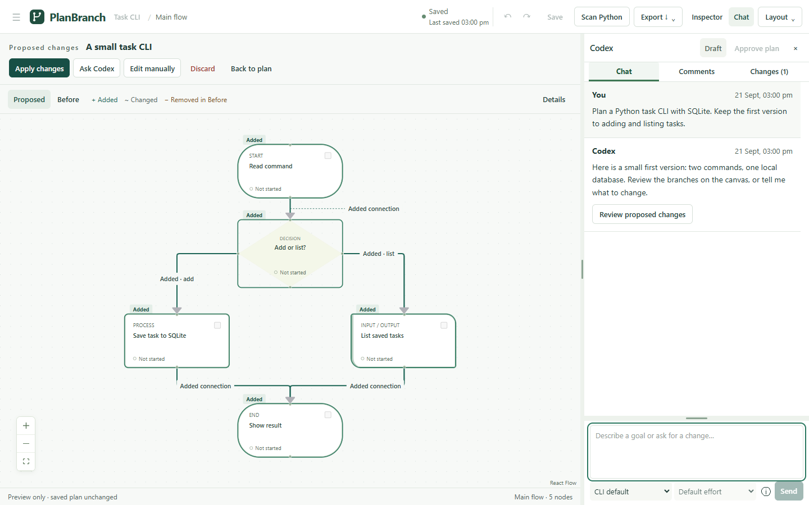

# PlanBranch

**Visual planning for AI-assisted coding.**

Turn a coding goal into a diagram you can discuss, correct, and approve. PlanBranch puts Codex chat beside an editable canvas, so proposed changes are visible before they become your plan.

[](https://github.com/AdrianIp0204/PlanBranch/actions/workflows/checks.yml)
[](LICENSE)


*The working app with sample data and a deterministic example conversation.*

## The workflow

1. **Describe the goal.** Chat through requirements; answer clarification cards with a choice or your own words.
2. **See the proposal.** Review nodes, branches, connections, and details on the canvas. Compare Before and Proposed.
3. **Refine it.** Ask Codex for changes, leave comments on individual nodes, or edit the candidate yourself.
4. **Apply and approve.** Apply changes as one undoable action, then approve the saved plan when it is ready.

PlanBranch currently supports planning and review. Approving a plan does **not** execute code or run its steps.

| Capability | What you can do |
| --- | --- |
| Visual planning | Build branching and looping diagrams with notes, pseudocode, checklists, blockers, and implementation targets. |
| Codex collaboration | Use your existing CLI sign-in, choose a model and reasoning level, answer structured questions, and review proposed edits. |
| Plan versus code | Keep intended variables separate from read-only Python scan results. Review and confirm links explicitly. |
| Local workspace | Work across projects and diagrams with autosave, restart-safe undo/redo, SQLite backups, and JSON, PNG, and Markdown exports. |

## Get started

Requires **Python 3.14** and **Node 24** to build. After setup, the Python application serves both the API and UI; a separate frontend server is unnecessary.

```sh
git clone https://github.com/AdrianIp0204/PlanBranch.git
cd PlanBranch
```

<details open>
<summary><strong>Windows · PowerShell</strong></summary>

```powershell
python -m venv .venv
.\.venv\Scripts\python.exe -m pip install -r requirements.lock
npm ci --prefix frontend
npm run build --prefix frontend
.\.venv\Scripts\python.exe -m flowdesk
```

</details>

<details>
<summary><strong>Linux</strong></summary>

```sh
python3.14 -m venv .venv
.venv/bin/python -m pip install -r requirements.lock
npm ci --prefix frontend
npm run build --prefix frontend
.venv/bin/python -m flowdesk
```

</details>

Open **[127.0.0.1:4310](http://127.0.0.1:4310)**, create a project, or load the removable example. The editor, scanner, and exports work offline. Installing dependencies needs internet access unless you supply a package cache.

For AI chat, separately [install Codex CLI](https://developers.openai.com/codex/cli/), run `codex login`, and restart PlanBranch. Chat uses your existing ChatGPT sign-in and requires internet access; PlanBranch does not require an API key. The connector has been tested with Codex CLI **0.144.1**. Available models and reasoning levels come from your installed CLI; account access may vary.

**Already using FlowDesk?** PlanBranch is the new name. The `flowdesk` Python module, database locations, export format, and browser preferences remain compatible. Stop the server before pulling and rebuilding, then restart with the same data directory and reload the browser.

## Your data and your decisions

- **Projects stay local.** SQLite stores saved plans, discussion, review records, and undo history. Choose a different location with `--data-dir`; the server binds to loopback only.
- **Chat shares authored context.** Sending a message shares the manual plan and discussion with Codex, including a candidate when you request revisions. Attached source files and scanner observations are excluded.
- **Changes require review.** Agent edits stay separate until you apply them. Manual proposal drafts save separately in SQLite and recover after browser or server restart; applying creates one undoable plan edit.
- **Evidence is read-only.** Python scanning requires an explicitly attached folder. It does not import or execute that code, change source files, or mark tasks complete.

See the [user guide](docs/User_Guide.md) for backups, draft recovery, sharing boundaries, scanner limits, keyboard controls, and exports. [Validation notes](VALIDATION.md) distinguish tested behavior from remaining platform and live-model checks.

## Development

The application uses **Flask, SQLite, React, TypeScript, Vite, and free React Flow**. No cloud backend or PlanBranch account is required.

```text
flowdesk/       Local API, storage, migrations, scanning, Codex connector
frontend/src/   Canvas, chat, review workspace, history, autosave
tests/          Backend tests and disposable browser acceptance fixtures
docs/           User guide and design/validation records
```

Run these from the repository root using your virtual environment's Python:

```sh
python -m pytest -q
npm test --prefix frontend
npm run build --prefix frontend
```

For browser checks, install Chromium once with `cd frontend && npx playwright install chromium`, return to the root, then run `npm run test:e2e --prefix frontend`. Tests use disposable databases and a deterministic planning provider, with external browser requests blocked.

Build an installable wheel with `python scripts/build_release.py` after building the frontend. Install `dist/flowdesk-0.1.0-py3-none-any.whl` in a Python 3.14 environment; launch with `planbranch` or `python -m flowdesk`. Node is unnecessary for the installed application. The distribution keeps its original `flowdesk` name for compatibility; this repository is the release source.

Bug reports and focused pull requests are welcome. Include reproduction steps and your platform; use sample projects when sharing screenshots or exports.

## License

[MIT](LICENSE) · Copyright © 2026 AdrianIp0204.
